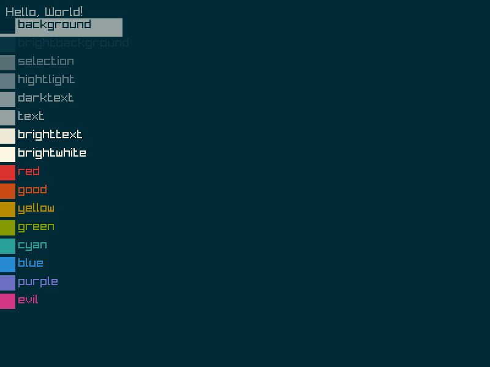
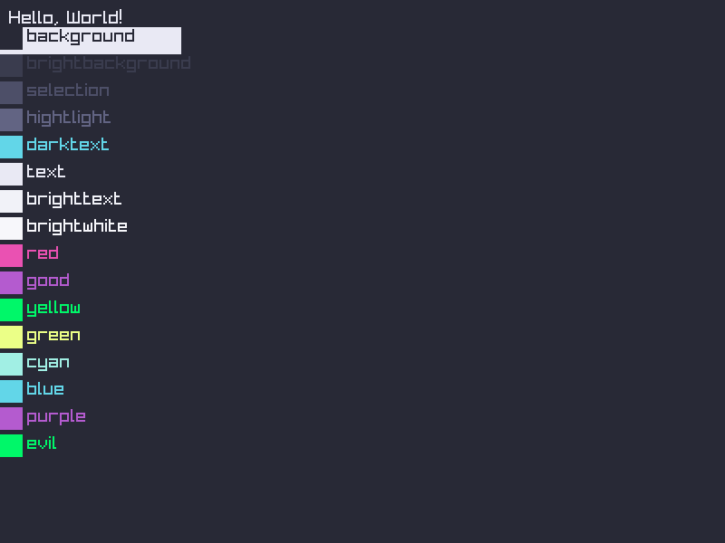

A quick a dirty parser/graber of base 16 color schemes, with a hotswapping. 
Also a raylib copy-paste folder.

#### notes:
* Not a proper yaml parser but it worked for 4 files I tested
* defualt hotswap uses zenity, but this is changable, see syntaxadvance.d for replacing pieces
* I dont care about copy rights, you may want to swap out the themes for whatever mit vs gnu debate zealoty